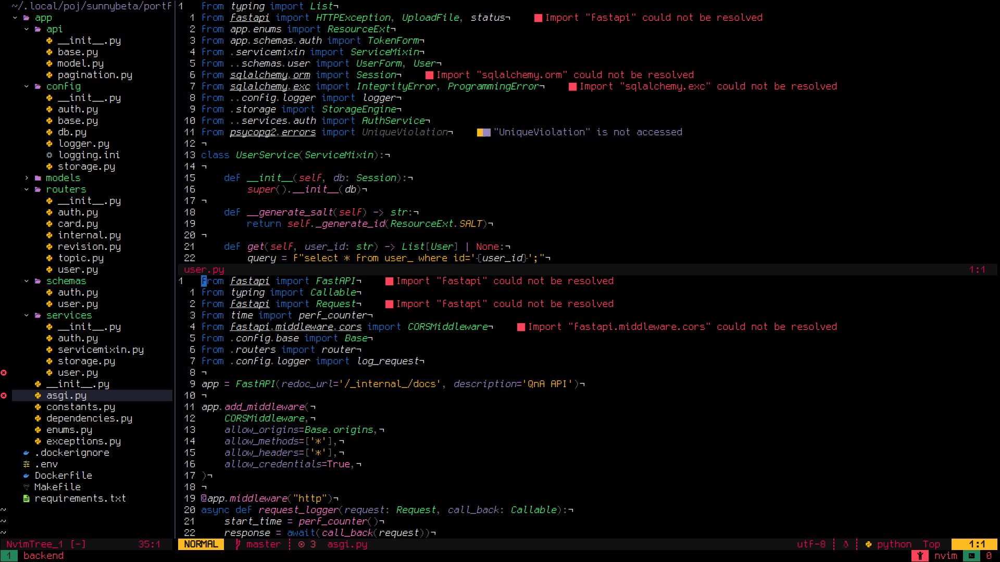

# Icecream for [Neovim](https://github.com/neovim/neovim)



## Credits

This colorscheme is based on the awesome [rosepine](https://github.com/rose-pine) colorscheme for [neovim](https://github.com/rose-pine/neovim).

## Install

### [Lazy](https://github.com/folke/lazy.nvim)

```lua
require('lazy').setup({
  {
    'icecreamtheme/neovim',
    name = 'icecream',
    lazy = false,
    priority = 1000,
  }
})
```

### [Packer](https://github.com/wbthomason/packer.nvim)

```lua
require('packer').startup(function(use)
  use({ 'icecreamtheme/neovim', as = 'icecream' })
end)
```

